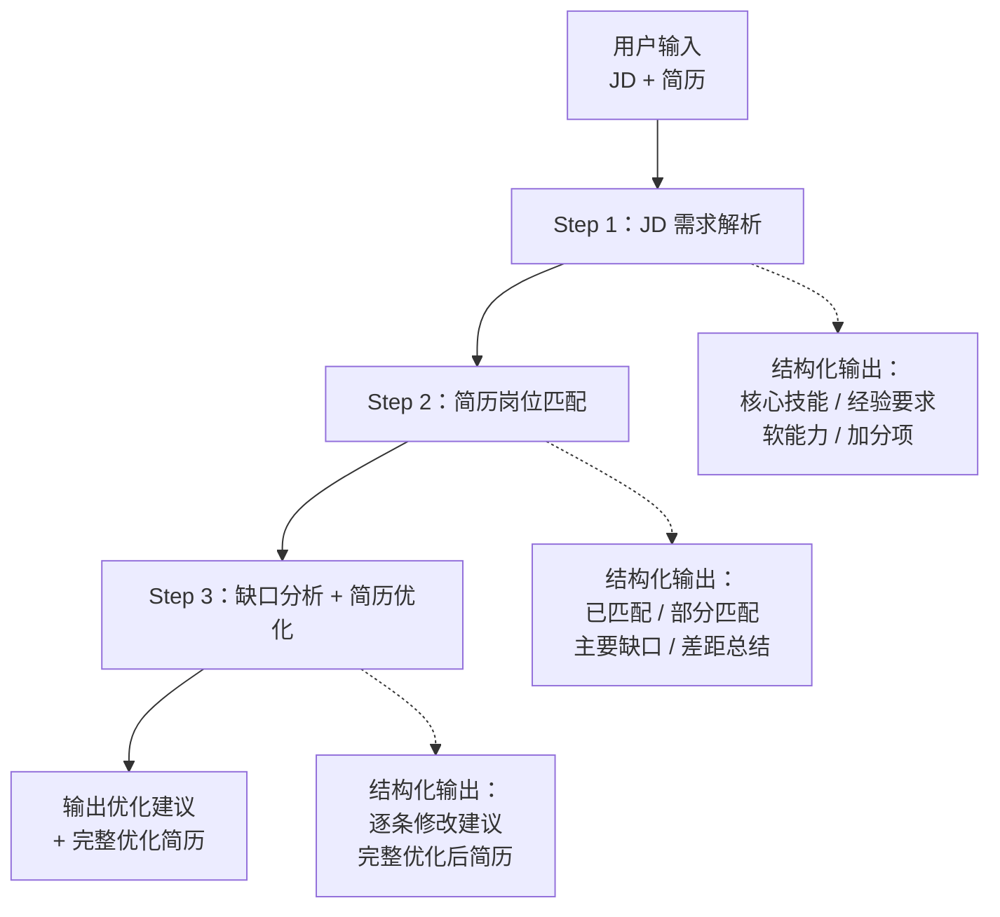

# AI 简历优化助手

面向校招求职场景的 AI 简历优化 Web MVP。

用户输入目标岗位 JD 和个人简历后，系统通过三阶段 AI Workflow 完成 **JD 需求解析 → 简历岗位匹配 → 缺口识别与简历优化**，最终输出可复制的优化后完整简历。

- 🌐 **在线 Demo**：https://ai-resume-optimizer.njq1335941222.workers.dev
- 📦 **GitHub**：https://github.com/enolanie/ai-resume-optimizer

> Demo 需要你在页面中配置自己的 AI API Key 后才能使用，详见下方「API Key 与隐私说明」。

---

## Screenshots

> Screenshots will be added after the first public demo validation.

---

## 项目背景

校招投递中，同一个人的经历往往需要针对不同岗位反复调整表述。常见的做法是：读 JD、凭感觉改简历、来回对照——过程重复、缺少结构化依据，也容易漏掉关键要求。

这个项目尝试把这件事做成一条可复用的流程：先让 AI 把 JD 拆成结构化的能力要求，再拿这些要求去简历里逐条找证据，明确区分「已匹配 / 部分匹配 / 未匹配」，最后基于**已有事实**做表达优化。

产品原则很简单：**AI 只负责重组和优化表达，不负责创造经历。**

---

## 功能

**输入**

- JD 文本输入
- 简历文本输入
- TXT 简历文件上传（自动读取并填入输入框）
- 目标岗位类型选择
- 草稿自动保存（刷新页面不丢失）

**AI 分析**

- AI 岗位需求解析
- AI 简历与岗位匹配分析
- 匹配 / 部分匹配 / 主要缺口识别
- AI 简历优化建议（原文 → 优化后 → 修改原因）

**输出**

- 生成完整优化后简历
- 一键复制优化结果

**配置**

- API Key 配置与连接测试
- 支持 OpenAI-compatible API / Anthropic / Custom Provider

---

## AI Workflow

三个步骤**串行调用**，前一步的结构化结果作为后一步的输入，而不是一次性塞进单个 Prompt。



**为什么拆成三步**

- 每步只做一件事，输出更稳定，也更容易定位问题出在哪一环
- 上一步的结构化结果约束了下一步的判断范围，减少模型自由发挥
- 每一步的中间结果都可以单独查看和校验

---

## AI 输出设计

项目不使用自由文本输出，而是要求模型返回**结构化 JSON**，前端再按字段渲染。这样既保证界面稳定，也让 AI 的每个判断都有明确归属。

| 字段 | 含义 |
|---|---|
| JD 能力要求 | `job_title` / `skills` / `experience_requirements` / `soft_skills` / `bonus` |
| 匹配情况 | `matched`：简历中有明确证据 |
| 部分匹配 | `partial`：有相关经历，但证据不足或覆盖不完整 |
| 主要缺口 | `missing`：JD 有要求，简历中没有明确证据 |
| 差距总结 | `gap_summary`：主要差距的简要归纳 |
| 优化建议 | `suggestions`：`section` / `original` / `optimized` / `reason` |
| 优化后简历 | `optimized_resume`：完整的优化后简历全文 |

每条匹配项都要求附带 `evidence`（简历中的依据原文），缺失项则明确留空——**不允许把"可能具备"写成"已经具备"**。

### 防止虚构经历的约束

Prompt 中写入了明确的硬性规则：

- 不虚构公司
- 不虚构项目
- 不虚构时间
- **不虚构数字**（如"提升 30%""服务 10 万用户"——只有原文已有的数字才允许保留和重组）
- 不把 JD 中要求的能力直接当成用户已有能力
- 简历中没有证据的 JD 要求，只能出现在"建议补充"中，不得直接写进优化后的简历
- 优先基于用户真实简历内容进行**重组和表达优化**

### JSON 解析的容错处理

大模型偶尔会返回带 Markdown 代码围栏、或前后夹带解释文字的 JSON。项目实现了独立的解析逻辑，能够处理纯 JSON、带围栏、带前后说明文字等常见形态，并能区分三种失败情况：**未找到 JSON / JSON 被截断 / JSON 格式错误**，给出对应的明确错误提示，而不是笼统报错或伪造结果。

---

## 技术栈

| 类别 | 选型 |
|---|---|
| 前端框架 | React 19.2.7 |
| 构建工具 | Vite 8.1.1 |
| 样式 | Tailwind CSS 4.3.2 |
| 路由 | React Router 7.18.1 |
| 语言 | JavaScript / JSX |
| AI 接口 | OpenAI-compatible API / Anthropic API / Custom Provider |
| 实际测试模型 | DeepSeek API |
| 代码检查 | oxlint |
| 部署 | Cloudflare Workers |
| 代码托管 | GitHub |
| 开发方式 | Claude Code |

---

## 项目结构

```
src/
├── pages/                    # 页面级组件
│   ├── HomePage.jsx          # 首页：产品介绍与入口
│   ├── SetupPage.jsx         # AI 配置页：Provider / API Key / 连接测试
│   └── AnalyzePage.jsx       # 分析页：状态编排（输入 → 分析中 → 结果 / 错误）
│
├── components/               # 可复用组件
│   ├── Header.jsx            # 全局导航
│   └── analyze/
│       ├── InputPanel.jsx        # JD / 简历输入、TXT 上传、草稿保存
│       ├── AnalysisProgress.jsx  # 三步分析进度展示
│       ├── ResultsPanel.jsx      # 结果展示与一键复制
│       └── ResultSection.jsx     # 结果卡片容器
│
├── services/                 # 业务逻辑层
│   ├── aiService.js          # AI 接口调用、错误处理、配置校验
│   ├── analysisService.js    # 三阶段分析链路的编排
│   └── prompts.js            # 三个阶段的 Prompt 模板
│
├── utils/                    # 工具函数
│   ├── apiConfig.js          # API 配置的本地存取
│   └── json.js               # 结构化 JSON 的容错解析
│
├── App.jsx                   # 路由配置
├── main.jsx                  # 应用入口
└── index.css                 # 全局样式
```

**分层思路**：`pages` 负责状态与流程编排，`components` 负责渲染，`services` 承载全部 AI 调用与业务逻辑，`utils` 放通用能力。页面组件中不含任何直接的 API 请求或 Prompt 文本。

---

## 本地运行

```bash
npm install
npm run dev
```

启动后打开终端提示的本地地址，进入 **AI 配置** 页面填入自己的 API Key，保存并测试连接成功后，即可在 **开始分析** 页面使用。

构建与检查：

```bash
npm run build     # 生产构建
npm run lint      # 代码检查
npm run preview   # 本地预览构建产物
```

---

## API Key 与隐私说明

- **API Key 由用户自行输入**，本项目不提供、不代管任何 Key
- API 配置保存在**浏览器本地（localStorage）**
- **本项目没有自己的数据库，也没有账号系统**
- 当前架构是**浏览器直接调用用户自行配置的 AI API**，请求不经过本项目的服务器
- **请勿将个人 API Key 提交到 GitHub**

> ⚠️ 这是一个 **Portfolio / MVP Demo**，用于验证产品思路与技术可行性，并非生产级 SaaS 产品。

---

## 项目特点

1. **从真实求职场景出发** —— 不是"给简历打分"这类泛化工具，而是围绕"同一份经历如何针对不同岗位重新表达"这个具体问题设计。
2. **形成完整产品闭环** —— JD → 能力模型 → 简历证据 → 缺口 → 内容优化，每一环的输出都是下一环的输入，而不是孤立的功能点堆叠。
3. **三阶段 AI Workflow，而非单次 Prompt** —— 通过任务拆分和结构化输出，让每一步的结果可校验、问题可定位。
4. **从产品设计做到可运行 MVP** —— 包含需求梳理、交互与状态设计、Prompt 设计、前端实现、异常处理，并完成了公网部署。

---

## 当前 MVP 的范围边界

以下能力**不在当前 MVP 范围内**，属于已知的边界，而非缺陷：

- 登录 / 注册
- 数据库
- 简历历史记录
- PDF / DOCX 复杂格式解析
- 自动投递
- 多 Agent 协作
- RAG 知识库
- 批量 JD 匹配

当前版本聚焦于验证「一条完整的简历优化流程」是否成立。

---

## License

本项目仅用于学习与作品集展示。
